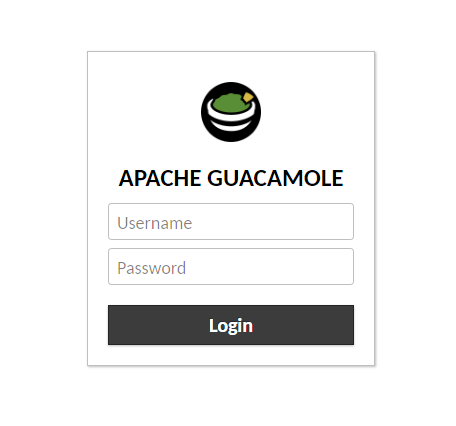
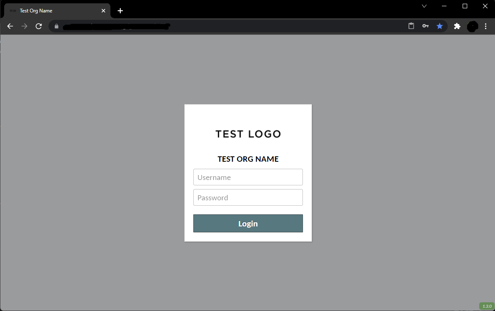
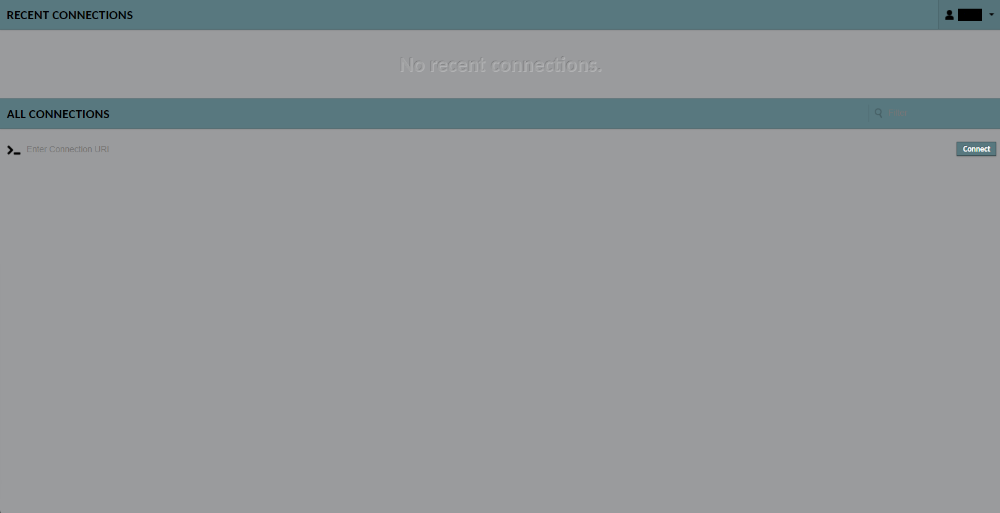

# `Branding` - A Guacamole Extension
This Apache Guacamole extension, in the form of a .jar file, is meant to act as a template for customizing or branding the Guacamole web application in order to utilize different colors, wording and/or logo. As is, it has a default placeholder logo, wording and colors. These can be updated within the .jar file without needing to buid the whole extension from scratch.

## Examples of Guacamole Login Pages
### Default (not using this extension)

### Using this extension unchanged (branding.jar)


## Why use the `Branding` extension?
Other options may be perfectly valid. The benefit of using an extension to accomplish customizing the appearence of the login page in Apache Guacamole is that it should persist through updates/upgrades and can be easily re-implemented on additional Guacamole servers or in the event of needing to re-deploy an Apache Guacamole server with the same customized login screen. It is also easier to remove the customization if its no longer needed.

## `Branding` Warnings
I highly recommend trying this in a test environment prior to attempting to use it in production. Its potential impact on an existing Apache Guacamole server should be nominal and easily reverible but it's better to be safe than sorry. Additionally, having a Guacamole server with the default login screen could prove helpful for comparisions and testing.

The original mailing list referencing this setup can be found [here](https://www.mail-archive.com/user@guacamole.incubator.apache.org/msg00914.html) on mail-archive.

## Downloading and Packaging the `Branding` extension to customize Apache Guacamole

To download to sample extesnion from this repository use the below command:
```
wget https://github.com/Zer0CoolX/guacamole-customize-loginscreen-extension/raw/master/branding.jar
```

There is also an [extracted version](branding/) in this repository in the `branding/` directory.

```
git clone https://github.com/Zer0CoolX/guacamole-customize-loginscreen-extension.git

cd branding/

## modify the files within branding and then save them ##

zip -r branding.jar *
```
## Modify the `Branding` extension to customize Apache Guacamole
I would recommend looking at the Guacamole web pages using the developer tools `[F12]` in your browser to inspect the elements and CSS properties. You can make temporary tweaks using these tools to see the changes live without needing to commit anything **(Make sure you document all your desired changes so you dont accidently loss you work!)**. Once you are satified alter the files for this extension and upload it to your Guacamole server to see the results.

The `branding.jar` file is just `.zip archive data`. You should be able to use archive manager programs like 7-zip to open the .jar file and view/edit the files contained within it.

The internal file structure is basically:  
```
├── branding
│   ├── css
│   │   └── login-override.css
│   ├── guac-manifest.json
│   ├── images
│   │   ├── logo-144.png
│   │   ├── logo-64.png
│   │   └── logo-placeholder.png
│   └── translations
│       └── en.json

3 directories, 6 files
```

`css`: 
- The **background colors, logo imag**e used and other cosmetic changes to the page are implemented changing the stylesheets in the `.css` file. 

`images`: 
- The images folder just contains the logo files. This has only been tested with a `.png` file. 

`translations`:
- The `.json` file(s) in the translations folder dictate what text is displayed for the title (and according to what language). 

Lastly the `guac-manifest.json` basically ties all those parts together so Guacamole can use them to customize the login screen to the desired specifications.

## Implement the `Branding` extension to customize Apache Guacamole
Once the `branding.jar` extension is updated to the desired parameters, it needs to be placed in the extensions folder used by Guacamole. This may differ according to Distro, method of installation and unique choices made when configuring Apache Guacamole. examples are provided below: 

* RHEL/CentOS `extensions` location:
```
/var/lib/guacamole/extensions
```
* Debian/Ubuntu `extensions` location:
```
/etc/guacamole/extensions/
```
* Docker `extensions` location:
```
# Default `GUACAMOLE_HOME` location on Docker instance
/root/.guacamole/extensions


# Create a local directory to store the extension
wget https://github.com/Zer0CoolX/guacamole-customize-loginscreen-extension/raw/master/branding.jar
mkdir -p /opt/guacamole/guacamole/extensions/
mv ./branding.jar /opt/guacamole/guacamole/extensions/

# Add the following volume to the Docker CLI command or Docker-Compose file for guacamole/guacamole

"/opt/guacamole/guacamole:/data"

# Add the following Environmental Variable to the Docker CLI command or Docker-Compose file for guacamole/guacamole

GUACAMOLE_HOME=/data
```


If using SELinux, you will likely need to set the proper context on the extension for it to work. As a baseline example this may be something like:

```
semanage fcontext -a -t tomcat_exec_t "/var/lib/guacamole/extensions/branding.jar"
restorecon -v "/var/lib/guacamole/extensions/branding.jar"
```

After doing so restart at least the guacamole service:

```
# Building from Source
systemctl restart tomcat

# Building from Docker (replace the conatainor name with what you defined)
docker-compose restart  OR  docker restart guacamole
```

Ensure the browser hasn't cached the old login page, if so clear the cache or try another method of accessing the site not previously used (another browser or another device).

If the parameters within the `branding.jar` are correct and the extension is in the proper directory the changes should be aparent on the login screen.

## Conclusion
This extension is meant to serve as a template for those looking to customize or brand the login page of an Apache Guacamole server. It does not alter any other aspect of the server. It does require a user to modify it to their needs which requires some base understandings like working with archive files, base CSS know-how, a working Apache Guacamole server (or the ability to set one up), etc.

If newly implementing a Guacamole server from scratch on RHEL/CentOS 7.x or up, may I recommend an installation script I have written to help more easily do so with additional options for things like LDAP, SSL, etc. including support to install your custom extension (your hopefully modified branding.jar file from this repo). This script can be found at:
https://github.com/Zer0CoolX/guacamole-install-rhel


## Cool Example of what it looks like overall
### Login


### Main

